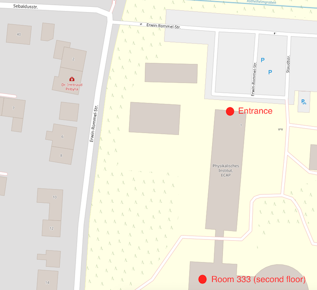
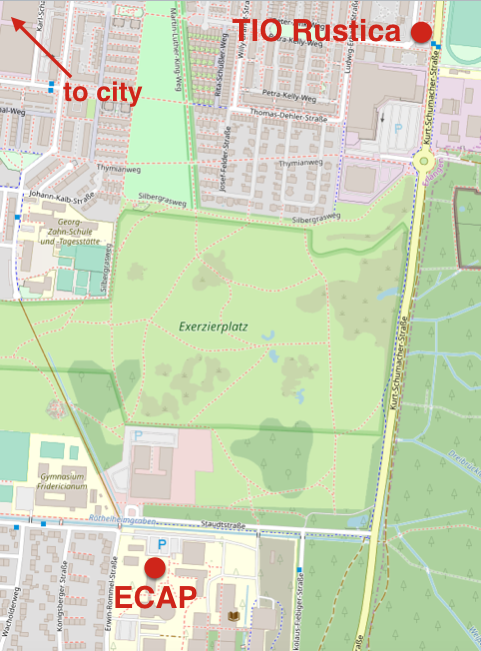

# Gammapy Coding Sprint, July 2019, Erlangen

* Start: Monday, July 15th, 2019 at 2 pm
* End: Friday, July 19th, 2019 at noon
* Location: ECAP, Erlangen (www.ecap.nat.fau.de)
* Contacts: [Lars Mohrmann](mailto:lars.mohrmann@fau.de), [Axel Donath](mailto:axel.donath@mpi-hd.mpg.de)

This meeting is a "coding sprint" for people that want to work on Gammapy
(http://gammapy.org/). You're very welcome if you're new to coding or haven't
contributed to Gammapy yet. But note that this is **not** a workshop how to use
Gammapy. We will also not do any tutorials how to hack on Gammapy, i.e. teach
git, Github, Python, pytest and Sphinx. Instead we will pair experienced and new
people and learn hands-on. If you want to prepare a bit, have a look at
[gammapy-dev-tutorial](https://github.com/gammapy/gammapy-dev-tutorial) and
learn a bit on your own before the coding sprint. Join the [Gammapy Slack](https://gammapy.slack.com) and
feel free to ask anything there.

## Travel and hotel

Travel directions are indicated on the ECAP webpages, see [here](https://ecap.nat.fau.de/index.php/contact).

Please book a hotel on your own. A list with some hotels can be found [here](https://docs.google.com/document/d/1LBscX9R25G0GtMRqb-NdGAnYSB1vBSzY-zA21XhhsKY). Note that there are more hotels in Erlangen, of course.

## Location of the meeting

The meeting will take place in room 333 at the Erlangen Centre for Astroparticle Physics. 
The address is: Erwin-Rommel-Str. 1, 91058 Erlangen.

Here's a map of the building: 

## Lunch

Vouchers for lunch in the university canteen will be provided on Tue-Fri.

## Dinner

There will be a common dinner on Wednesday, July 17, 19:00 (at your own cost). We will go to "[Tio Rustica](http://www.tio-erlangen.de/index.php?id=8)", which can be reached from ECAP easily by foot.

## Agenda

### Monday

Remote connection will be possible with eZuce (connection detail are [here](ezuce.txt)).

| Time          | Program          |
| ------------- |----------------- |
| 14.00 - 15.30 | Presentations 1  |
| 15.30 - 16.00 | Coffee Break     |
| 16.00 - 18.00 | Presentations 2 / Coding / Discussion Session |

Presentations 1:

- Axel Donath / Lars Mohrmann: Welcome and local information ([slides](https://github.com/gammapy/gammapy-meetings/blob/master/coding-sprints/2019-07-Erlangen/intro.pdf)) (5 min.)
- Lars Mohrmann: H.E.S.S. validation paper status ([slides]()) (10 + 5 min.)
- Andi Specovius: smoothing of cosmic-ray background models  ([slides](https://github.com/gammapy/gammapy-meetings/blob/master/coding-sprints/2019-07-Erlangen/Gammapy_CodingSpring_Smoothing_of_Bg_Model.pdf)) (10 + 5 min.)
- Luca Giunti: 3D joint-likelihood analysis using Fermi-LAT and H.E.S.S. data ([slides]()) (10 + 5 min.) 
- José Enrique Ruiz: PIG 12 - High-level interface ([PIG 12](https://github.com/cdeil/gammapy/blob/pig-12/docs/development/pigs/pig-012.rst)) (10 + 5 min.)

Presentations 2:
- Régis Terrier: PIG 11 - Light curves ([PIG 11](https://github.com/dcfidalgo/gammapy/blob/pig_improve_lc/docs/development/pigs/pig-011.rst)) (10 + 5 min)
- Christoph Deil: PIG 13 - Gammapy dependencies and distribution ([PIG 13](https://github.com/cdeil/gammapy/blob/pig-11/docs/development/pigs/pig-013.rst])) (5 + 10 min.)
- Christoph Deil: PIG 16 - Gammapy package structure ([PIG 16](https://github.com/cdeil/gammapy/blob/pig-16/docs/development/pigs/pig-016.rst)) (5 + 10 min.)
- Christoph Deil: PIG 14 - Uncertainty estimation ([PIG 14](https://github.com/cdeil/gammapy/blob/pig-14/docs/development/pigs/pig-014.rst)) (5 + 10 min.)
- Axel Donath: ideas on new API for data reduction (10 + 5 min.)
- Axel Donath: project ideas for the coding sprint (5 - 10 min.)

### Tuesday

| Time          | Program          |
| ------------- |----------------- |
| 9.00 - 10.30  | Coding / Discussion Session 1 |
| 10.30 - 11.00 | Coffee Break     |
| 11.00 - 12.30 | Coding / Discussion Session 2 |
| 12.30 - 14.00 | Lunch            |
| 14.00 - 15.30 | Coding / Discussion Session 3 |
| 15.30 - 16.00 | Coffee Break     |
| 16.00 - 18.00 | Coding / Discussion Session 4 |

### Wednesday

| Time          | Program          |
| ------------- |----------------- |
| 9.00 - 10.30  | Coding Session 1 |
| 10.30 - 11.00 | Coffee Break     |
| 11.00 - 12.30 | Coding Session 2 |
| 12.30 - 14.00 | Lunch            |
| 14.00 - 15.30 | Coding Session 3 |
| 15.30 - 16.00 | Coffee Break     |
| 16.00 - 18.00 | Coding Session 4 |
| 19.00             | Diner            |

### Thursday

| Time          | Program          |
| ------------- |----------------- |
| 9.00 - 10.30  | Coding Session 1 |
| 10.30 - 11.00 | Coffee Break     |
| 11.00 - 12.30 | Coding Session 2 |
| 12.30 - 14.00 | Lunch            |
| 14.00 - 15.30 | Coding Session 3 |
| 15.30 - 16.00 | Coffee Break     |
| 16.00 - 18.00 | Coding Session 4 |

### Friday
| Time          | Program          |
| ------------- |----------------- |
| 9.00 - 10.30  | Coding Session 1 |
| 10.30 - 11.00 | Coffee Break     |
| 11.00 - 12.30 | Coding Session 2 |
| 12.30 - 14.00 | Lunch            |
| 14.00 END     | Leave at any time you like|

## Registered Participants

1. Lars Mohrmann, ECAP, Erlangen ([lmohrmann](https://github.com/lmohrmann))
1. Axel Donath, MPIK Heidelberg, Germany ([adonath](https://github.com/adonath))
1. Christoph Deil, MPIK, Heidelberg, Germany ([cdeil](https://github.com/cdeil))
1. Bruno Khelifi, APC, IN2P3/CNRS, France ([bkhelifi](https://github.com/bkhelifi))
1. Régis Terrier, APC, IN2P3/CNRS, France ([registerrier](https://github.com/registerrier))
1. Luca Giunti, APC & DAp, IN2P3/CNRS & CEA_Saclay, France ([luca-giunti](https://github.com/luca-giunti))
1. Léa Jouvin, IFAE Barcelona, Spain ([leajouvin](https://github.com/JouvinLea))
1. José Enrique Ruiz, IAA-CSIC Granada, Spain ([bultako](https://github.com/bultako))
1. Fabio Pintore, INAF/IASF Milano, Italy ([fabiopintore](https://github.com/fabiopintore))
1. Quentin Remis, MPIK Heidelberg, ([Qremy](https://github.com/QRemy))
1. Dmitry Malyshev, ECAP, Erlangen ([dima137](https://github.com/dima137))
1. Kaori Nakashima, ECAP, Erlangen ([kaoriinakashima](https://github.com/kaoriinakashima))
1. Yu Wun Wong, ECAP, Erlangen ([yuwunwong](https://github.com/yuwunwong))

