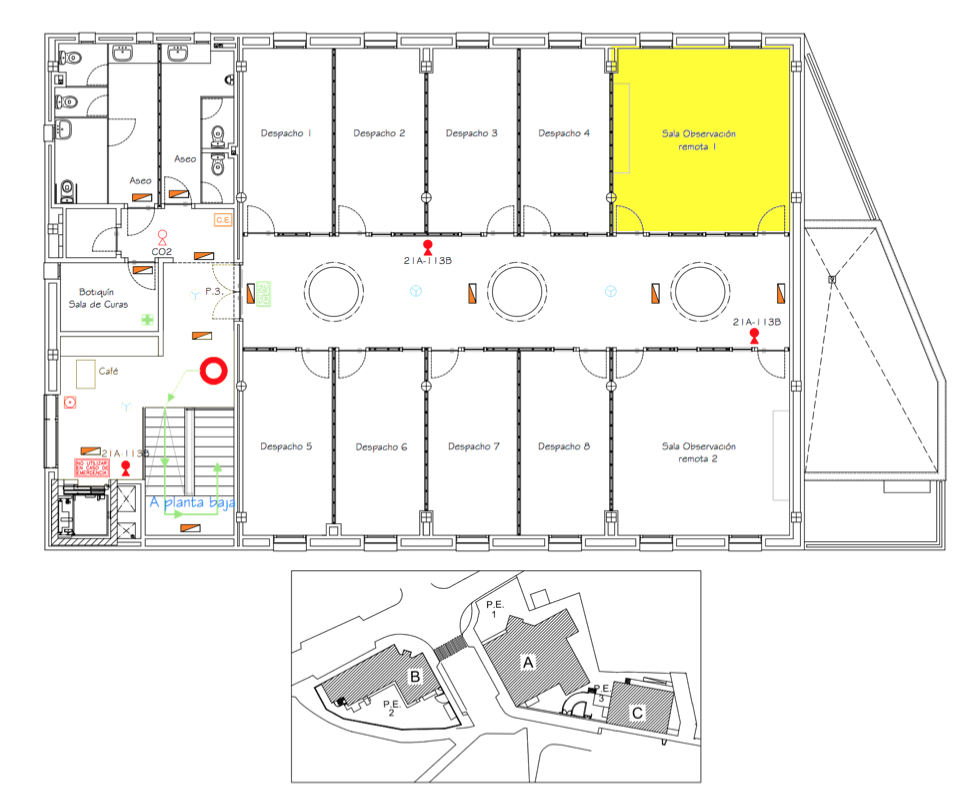

# Gammapy Coding Sprint, November 2019, Granada

* Start: Monday, Nov 18, 2019 at 2 pm
* End: Friday, Nov 22, 2019 at noon
* Location: Instituto de Astrofísica de Andalucía IAA-CSIC, Granada([https://www.iaa.csic.es](https://www.iaa.csic.es))
* Contacts: [Jose Enrique Ruiz](mailto:jer@iaa.es), [Axel Donath](mailto:axel.donath@mpi-hd.mpg.de)

This meeting is a "coding sprint" for people that **want to work on the development** of Gammapy
(http://gammapy.org/). You're very welcome if you're new to coding or haven't contributed to 
Gammapy yet. But note that this is **not** a workshop how to use Gammapy. We will also **not**
do any tutorials how to hack on Gammapy, i.e. teach git, Github, Python, pytest and Sphinx. 

## Travel

Granada has a small airport with domestic flights mostly from Madrid and Barcelona, and very few international flights. Bus shuttles are available to drive you from Granada airport to the city. For those coming from abroad connection flights with Madrid or Barcelona should be the best option, though for those coming from Germany a good option could also be a connection flight through Palma de Mallorca. In case you do not find suitable flights to Granada, you may consider Malaga airport which is the nearest big international airport, and lies about 130 km from Granada. A convenient 2 hour bus ride should take you to Granada (see https://www.alsa.com/en/web/bus/home) from Malaga airport. 

## Hotels/ Map Link

You may find the nearest hotels to the IAA-CSIC, as well as its location and those for the airports bus stops in the map below. Some other relevant info could be added to the map in the coming weeks, before or during the the coding sprint.

https://www.google.com/maps/d/viewer?hl=es&mid=1x0RD-_l8iLCpOIWFHDF2SU8WCVWtsamt&ll=37.16185642024251%2C-3.5874138335552743&z=13

## Location of the meeting

The meeting will be held at the [Instituto de Astrofísica de Andalucía IAA-CSIC](https://www.iaa.csic.es), in the **Assembly Room of the first floor of Building C**. Indication panels on place should drive you seamlessly to the room.

## Agenda

- Monday afternoon: plenary presentations & discussion
- Rest of the week: work in small groups

## Participants

1. Axel Donath, MPIK Heidelberg, Germany ([adonath](https://github.com/adonath))
1. José Enrique Ruiz, IAA-CSIC Granada, Spain ([bultako](https://github.com/bultako))
1. Judit Pérez-Romero, IFT UAM-CSIC Madrid, Spain ([peroju](https://github.com/peroju)) 
1. Christoph Deil, MPIK Heidelberg, Germany ([cdeil](https://github.com/cdeil))
1. Régis Terrier, APC, France ([registerrier](https://github.com/registerrier))
1. Luca Giunti, APC, France ([luca-giunti](https://github.com/luca-giunti))
1. Quentin Remy, MPIK Heidelberg, Germany ([QRemy](https://github.com/QRemy))
1. Léa Jouvin, IFAE Barcelona, Spain ([JouvinLea](https://github.com/JouvinLea))
1. Bruno Khelifi, APC, France ([bkhelifi](https://github.com/bkhelifi))
1. Atreyee Sinha, LUPM, France ([AtreyeeS](https://github.com/AtreyeeS))
