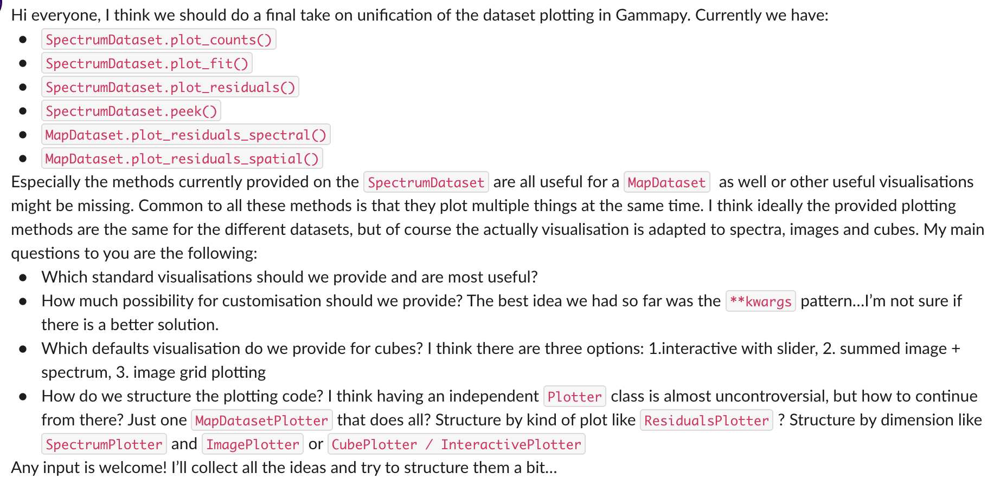

# Gammapy Developer Meeting

* Friday, March 19th, 2021 at 10 am
* "Gammapy Developer Meeting" on Zoom (direct link on Slack)
# Agenda

* [Gammapy pulse from last week](https://github.com/gammapy/gammapy/pulse)
* [Open pull requests](https://github.com/gammapy/gammapy/pulls)
* Short report by everyone, what they have worked on during the past week 

* Co-working week Doodle: https://doodle.com/poll/ghyiqivssp8vk6x9?utm_source=poll&utm_medium=link (Axel)
* Optional default selection for Estimators: https://github.com/gammapy/gammapy/pull/3277 (Axel)
* Dataset plotting: 

* Additional estimator quantities:
    - counts vs npred
    - excess vs npred_signal
    - background vs npred_background
    
* Tutorials page: https://docs.gammapy.org/dev/tutorials/index.html (José Enrique / Axel)
* Documentation list: https://github.com/gammapy/gammapy/issues/3143 (everyone)
* Anything else?
