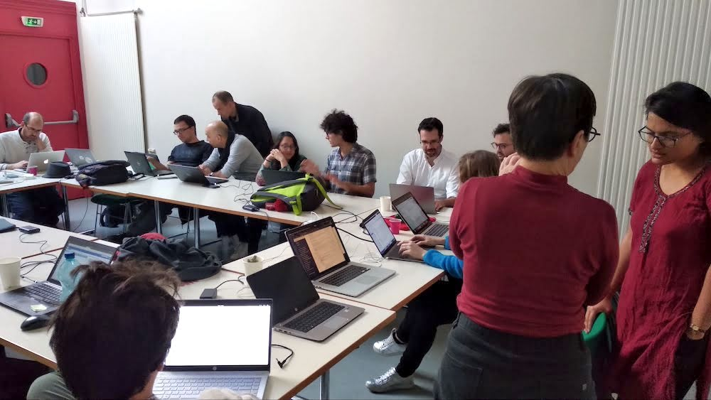

# gammapy user test session

The goal of this user-test is to have people of different expertise perform some common use cases and see what kind of difficulties they could encounter along the way. This is not going to be a tutorial and the idea is to be that little mouse sneaking in the office of a gammapy user and see what could be improved in terms of user experience.

## Summary:

We have had lots of feedback from users during the event. We summarized it in the following page: 

* **[Meeting summary](summary.md).**
* Original document with all suggestions can be found [here](https://docs.google.com/document/d/1fmtnbt-kwzLo09d1yQ2snsoznIVUxAdzx_QpnMZcXaU/edit#).

## Attendance

## Date, location

- Observatoire de Paris salle Danjon (one of the door in the stables facing the canteen [see Map here](Danjon_Obs_Paris.jpg))
- December 4th 2019: 09h30 - 17h30

## Instructions

The detailed instructions can be found [here](instructions.md)
